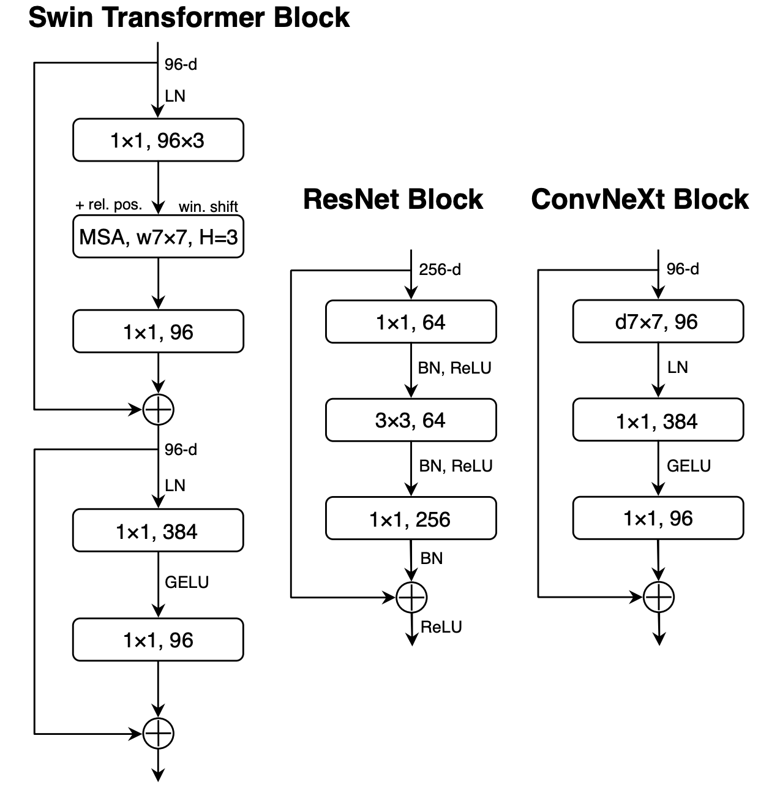
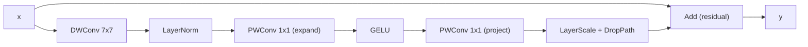
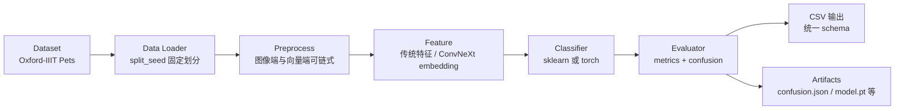
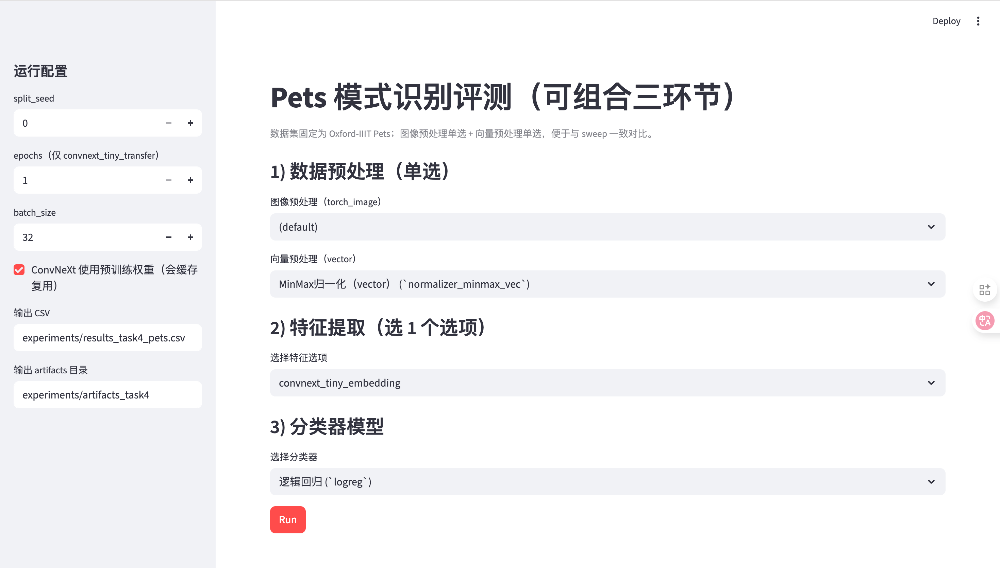
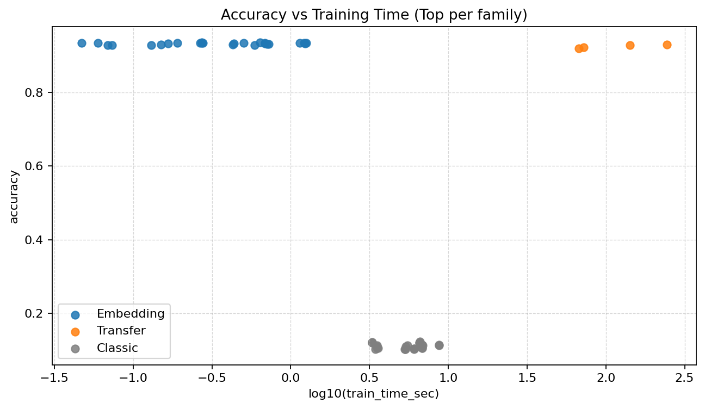
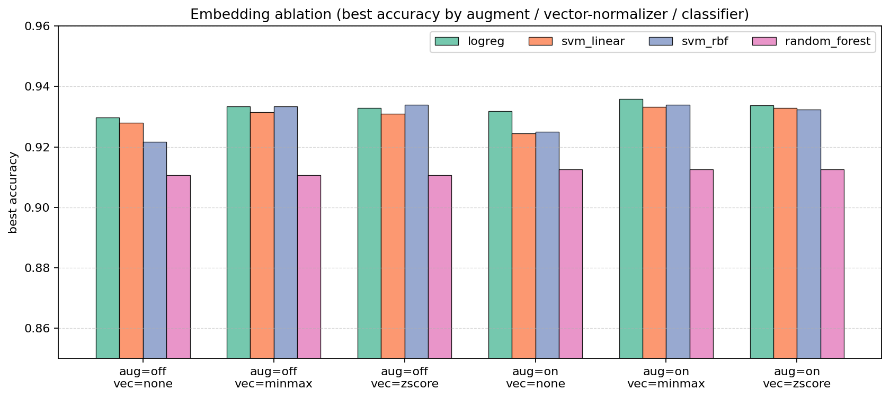
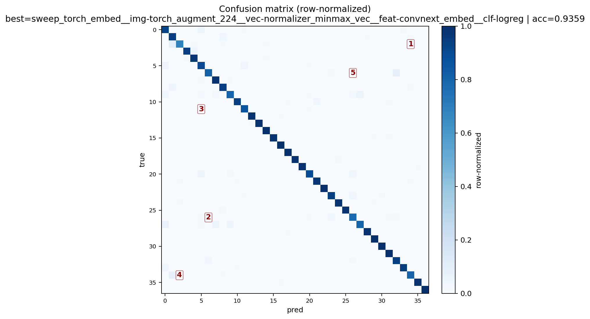
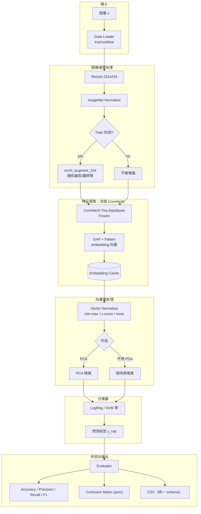

# 模式识别课程论文：基于 ConvNeXt 表征的细粒度宠物分类系统设计与评测

<div align="center">

学号：249434　　姓名：赵仲海

</div>


## 摘要

本文面向 Oxford-IIIT Pets 细粒度图像分类任务（37 类）[1][4]，设计并实现一套可复现、可组合的模式识别流水线评测系统。系统采用插件式架构，将预处理、特征提取、分类器与评测解耦，并以统一 CSV schema 记录各组合的性能与耗时。实验表明，使用预训练 ConvNeXt-Tiny 的冻结 embedding 作为主要特征，再接入轻量线性分类器（Logistic Regression）[7]，在测试集上取得约 0.936 的准确率，同时训练耗时显著低于端到端迁移学习。本文进一步通过消融实验分析了图像增强、向量归一化与分类器选择对性能的影响，并对误差来源进行讨论。最后，我实现了一个基于 Streamlit 的简单前端界面，便于演示不同模块组合与结果导出。

关键词：模式识别；迁移学习；表征学习；ConvNeXt；细粒度分类；Logistic Regression

## 1 引言

### 1.1 研究背景与意义

在模式识别中，图像分类是一个非常典型也很能体现“系统设计思路”的任务。一般来说，我们可以把它形式化为：给定输入 $x$（图像），学习一个判别函数 $f(x)$，输出类别 $y\in\{1,\dots,K\}$。过去的经典路线更依赖手工特征（边缘、纹理、颜色统计等）再配合浅层分类器；而近年来更主流的做法是借助大规模数据上预训练的深度模型学习通用表征，然后通过迁移学习或“冻结表征+轻量分类器”的方式迁移到具体任务上。

### 1.2 问题定义

本文选取 Oxford-IIIT Pets 数据集作为实验对象，任务是 37 类的细粒度分类（类别之间外观相近、区分难度较高）。模型的输出是每张图像的类别标签；评测时我主要报告 Accuracy、Precision、Recall、F1，并同时记录训练与推理耗时，用来更全面地反映不同方案在“效果—成本”上的权衡。

### 1.3 本文贡献

围绕以上问题，我在课程项目中主要完成了三件事：
- 第一，设计并实现了模块化评测框架，把预处理、特征提取、分类器与评测解耦，使“传统方法”和“现代方法”可以在同一套 CSV schema 下进行相对公平的对比；
- 第二，以 ConvNeXt 的冻结 embedding 为核心特征，搭建了一条“强表征 + 轻分类器”的分类系统，并通过实验验证其在本任务上的效率与效果；
- 第三，基于 sweep 的大规模组合结果，总结出可复现的经验结论，并用消融实验进一步分析关键因素对性能的影响；
- 第四，实现了一个基于 Streamlit 的最小前端界面，支持模块化选择与一键运行，用于课程展示与快速对比。

## 2 相关工作与理论基础

### 2.1 传统模式识别流程回顾

从经典模式识别角度看，一个较标准的流程通常包括三个环节（我们忽略了数据采集等前期数据准备环节）：先做预处理（例如降噪、归一化、尺寸对齐），再做特征提取（例如 HOG、LBP、颜色直方图，必要时再接 PCA 做降维），最后用分类器完成判别（例如 SVM、随机森林或 Logistic Regression）[7]。本项目也保留了这条路线作为基线，用于与现代方法形成对照。

### 2.2 迁移学习与冻结表征

在现代深度学习框架下，迁移学习通常指：先使用 ImageNet 等大规模数据上预训练好的 backbone，再通过微调（fine-tuning）学习下游任务的分类头，必要时还会解冻部分 backbone 参与训练[3]。

与之对应的“冻结表征”思路则更轻量：直接固定 backbone 的参数，仅把模型输出的 embedding 当作特征向量，再用传统分类器训练最终的判别器。本文的主线正是基于后者展开。

### 2.3 ConvNeXt 简述

ConvNeXt 可以理解为“把 CNN 的设计做得更像现代 Transformer 训练范式”的一种卷积网络[2]：它仍然保留了卷积在视觉任务上的归纳偏置（局部性、平移等不变性），但在网络结构和训练细节上吸收了很多近年来有效的经验做法，从而在 ImageNet 等基准上取得很强的效果，并且迁移到下游任务时也比较稳定。基于这一点，本文选择 ConvNeXt 作为主要特征提取 backbone。

为了更直观地说明 ConvNeXt 的设计思路，我在图 2.1 中展示了 Swin Transformer Block、ResNet Block 与 ConvNeXt Block 的结构对比。

<div align="center"></div>

<div align="center">图 2.1：Swin Transformer Block，ResNet Block 和 ConvNeXt Block 结构图</div>

从整体结构上看，ConvNeXt 延续了分层金字塔式的 CNN 设计：输入图像先经过一个 stem 把分辨率快速降下来，然后进入 4 个 stage，每个 stage 内部堆叠若干个“ConvNeXt Block”，并在 stage 之间通过下采样逐步降低空间分辨率、提升通道数。以本文使用的 ConvNeXt-Tiny 为例，它的 stage 深度通常记为 $[3,3,9,3]$，对应的通道数（feature dimension）为 $[96,192,384,768]$；最后通过全局平均池化（GAP）得到一个全局表征向量，再接分类 head 输出类别。

更关键的是 ConvNeXt Block 的内部结构。它的核心思想是用“深度可分离卷积 + 逐点卷积”来在保证感受野的同时控制计算量，并把归一化与非线性放在更适合大规模训练的位置。一个典型的 ConvNeXt Block 可以概括为：先做一个较大核的 depthwise conv（常见为 $7\times 7$）来扩大感受野；随后做 LayerNorm（注意是 LN 而不是 CNN 里更常见的 BN）；再用两个 $1\times 1$ 的 pointwise conv 构成类似 MLP 的“扩展—压缩”结构（先把通道扩展到原来的 4 倍左右，经过 GELU，再投影回原通道数）；最后加上残差连接，并配合 LayerScale/DropPath 等技巧提升训练稳定性。
为了更直观地展示残差连接的位置，我把上述伪结构画成了图 2.2（ConvNeXt Block 简化结构）。


<div align="center">图 2.2：ConvNeXt Block 简化结构（DWConv + LN + PWConv + 残差）</div>

对本文任务来说，我更关注的是它作为“特征提取器”时输出的表征质量：ConvNeXt-Tiny 经过 ImageNet 预训练后，最后一层 stage 的特征已经具备较强的通用性。因此在本项目的 embedding 路线里，我冻结 ConvNeXt 的参数，只把其输出特征做 GAP 得到定长向量（通常为 768 维），再交给传统分类器去学习决策边界，这也是本文后续实验里最有效、也最符合课程项目资源限制的一条路线。

## 3 系统设计与实现

### 3.1 总体架构（插件式流水线）

本系统采用插件式流水线实现，整体可以拆成 Data Loader（数据加载与划分）、Preprocess（可链式预处理）、Feature（特征提取，既支持传统特征也支持 embedding）、Classifier（分类决策，支持 sklearn[5] 与 torch[6] 两类实现）以及 Evaluator（指标计算、混淆矩阵与 CSV 输出）五个模块。这样的拆分方式让我可以用相同的评测口径，把不同方法组合起来做系统比较。

为了更直观地说明模块之间的关系，我把流水线的“数据流向”和“产物输出”画成了图 3.1。实际运行时，我只需要在每个模块上替换不同实现（例如不同预处理、不同特征或不同分类器），就能得到同一 schema 的结果 CSV，方便后续做横向对比。


<div align="center">图 3.1：插件式流水线总体结构（Data Loader→Preprocess→Feature→Classifier→Evaluator）</div>

图 3.1 的意义在于：它把“实现层面的解耦”对应到“实验层面的可组合”。我在写实验脚本时只要枚举不同模块的组合，就可以批量得到结果，并且这些结果天然能放到同一张表里排序、画图与分析。


### 3.2 统一接口与可组合性

为了让不同模块能够自由组合，本项目在实现上尽量统一接口形式，核心是 `fit / transform / predict` 三类方法；在使用时按照 `preprocess -> feature -> classifier` 的顺序串起来即可。评测结果统一写入同一份 schema 的 CSV，这样做的好处是我后续可以直接批量汇总、排序、画图，而不用为每个方法单独写一套统计脚本。

### 3.3 核心方案：ConvNeXt-Tiny 冻结 embedding + 传统分类器

本文的核心方案可以看成是把模式识别的经典三段式（预处理—特征—分类）完整落在深度预训练表征的语境下：图像端做统一的尺寸与归一化（可选增强），特征端由冻结的 ConvNeXt 输出 embedding，分类端用传统分类器（以 LogReg 为主）学习决策边界，最后由评测模块统一输出指标与混淆矩阵。为了把这条主线说得更清楚，我在附录 A 给出了系统架构示意图（见图 A.1）。

在图 A.1 中我特意标出了 embedding cache：它不是算法“本身”的一部分，但对课程项目的实验效率非常关键。因为在 sweep 时，同一套图像预处理与同一个 ConvNeXt embedding 可以被多个后端分类器复用，这样我就能把时间更多花在“对比与分析”上，而不是重复做相同的特征抽取。

#### 3.3.1 图像预处理

在图像端，我把输入统一 resize 到 224×224，并按 ImageNet 的 mean/std 做归一化；同时提供可选的训练增强（例如 RandomResizedCrop、Flip 等），用于提升模型的泛化能力。

#### 3.3.2 embedding 提取

在特征提取阶段，我使用 torchvision 提供的 `convnext_tiny` 预训练权重，并取 `features + GAP + Flatten` 作为最终的 $D$ 维 embedding。这里的关键点是冻结模型参数，只做前向提取，把“学习复杂表征”的工作交给预训练模型，把“拟合分类边界”的工作交给后端分类器。

#### 3.3.3 分类器设计

分类器方面，我主要使用 Logistic Regression 作为默认选择（线性判别、训练快且稳定），并引入 SVM（线性 / RBF）作为对比，以便观察“更强判别器”在 embedding 空间里是否还能带来明显收益。

### 3.4 对比方案

为了让结论更有说服力，本文还实现并评测了两类对比方案：一类是端到端迁移学习（基于 ConvNeXt-Tiny，训练分类头或进行部分微调），另一类是传统手工特征路线（例如 HOG/LBP/颜色直方图，再接 SVM/RF）。

### 3.5 前端界面（Streamlit）

为了方便课程展示与快速复现实验组合，我实现了一个最小的 Streamlit 前端（入口：`web/app.py`）。它的定位不是“替代命令行/脚本”，而是把最常用的单次评测流程做成可交互界面：我可以在页面上选择三段式组合（预处理→特征→分类器），点击一次 Run 就完成一次训练/评测，并直接生成与 sweep 一致口径的结果 CSV。

界面功能上，这个前端主要做三件事：

第一，提供可复现的运行参数入口（侧边栏）：例如 `split_seed`、`batch_size`，以及迁移学习分类器专用的 `epochs`；同时提供 `pretrained` 开关与输出路径（结果 CSV 与 artifacts 目录）。

第二，以“1) 预处理（单选）→2) 特征提取（选 1 个选项）→3) 分类器模型”的顺序组织交互，并对不合法组合给出最小提示（例如选择端到端迁移学习时，特征提取必须为 (none)）。

第三，Run 之后展示本次评测的结果行（CSV 单行）与关键指标（例如 Accuracy），用于课堂展示与快速对比。

界面截图如图 3.2 所示。

<div align="center"></div>

<div align="center">图 3.2：Streamlit 前端界面截图（模块选择与一键运行）</div>

前端启动方式如下（在项目根目录执行）：

```bash
source .venv/bin/activate
streamlit run web/app.py
```

## 4 实验设置

### 4.1 数据集与划分

实验数据集采用 Oxford-IIIT Pets。为了保证不同方法之间的可比性与实验可复现性，我固定了数据划分的 `split_seed`，并在全文中都使用同一份划分来汇报主要结果。

为保证不同方法的可比性，本文的主要对比结果均在同一 `split_seed=0` 的划分上评测，并统一输出同一份 CSV schema（dataset/split_seed/preprocess/feature/classifier/accuracy/…/time）。

但仅在单一划分上得出结论仍可能存在“刚好碰巧”的风险。因此本文额外补充了 multi-seed 稳定性检验：只挑选两条最强代表方案（最优 embedding+LogReg、以及最优 transfer(5 epochs)），在 `split_seed∈{0,1,2}` 上重复评测，并报告均值±标准差（见第 5.2.1）。

### 4.2 实验组合与遍历（Sweep）

在实验设计上，我使用 sweep 的方式遍历多种组合，尽量覆盖“传统 vs 现代”的代表性配置：传统路线主要由图像预处理 × 手工特征（可含 PCA）× 传统分类器组成；现代路线则拆成两支，其一是 embedding 路线（torch 图像预处理 × ConvNeXt embedding（可选接 PCA）× 向量分类器），其二是 transfer 路线（torch 图像预处理 × 端到端训练分类器）。

可复现命令（示例）：

- 运行全量 sweep（输出 raw 与 leaderboard）：

```bash
python -m experiments.task4_runner --sweep --split-seed 0 --epochs 1 --batch-size 32 --num-workers 0 \
  --out-csv experiments/sweep_all_raw.csv \
  --leaderboard-csv experiments/sweep_all_leaderboard.csv --topk 30
```

- 补充迁移学习更公平实验（本文使用 5 epochs，head/partial）：

```bash
python -m experiments.task4_runner --split-seed 0 --batch-size 32 --num-workers 0 \
  --combo-json experiments/transfer_more_epochs_combos.json \
  --out-csv experiments/transfer_more_epochs_raw.csv \
  --out-dir experiments/artifacts_task4_transfer_e5
```

### 4.3 评价指标与耗时统计

评价指标方面，本文主要使用 Accuracy、Precision、Recall、F1，并同时记录 `train_time_sec` 与 `inference_time_sec` 来刻画训练与推理成本；此外还保存混淆矩阵（json）用于后续的错误分析。

说明：本框架对 embedding 流水线做了 embedding 结果缓存（同一数据划分与相同 torch 图像预处理下，抽取一次 embedding 后可复用）。因此：

当我连续评测多个“同一 embedding + 不同向量分类器”的组合时，后续组合的 `train_time_sec/inference_time_sec` 往往更像是“缓存复用后的增量开销”，而不是从头抽取特征的总成本。

因此更合理的理解方式是把总耗时拆成两部分：一次性的 embedding 抽取成本 $T_{embed}$ 与每个分类器训练/预测成本 $T_{clf}$，整体可以写成 $T=T_{embed}+T_{clf}$。在 sweep 场景下，$T_{embed}$ 会被多个组合摊薄，这也是 embedding 路线在课程项目里看起来特别“省时间”的原因之一。

## 5 实验结果

本项目已完成一次大规模组合遍历（sweep），并额外补充了更公平的迁移学习实验（将训练从 1 epoch 增加到 5 epochs，并对 head/partial 两种微调策略进行对比）。

在“如何选最终系统方案”这一点上，本文采用的选择准则比较朴素：以测试集 accuracy 为主排序；若多个方案的 accuracy 非常接近（例如差异在 0.002 以内），则优先选择训练/推理更省时、实现更简单且更稳定的方案（这也是我最终偏向 embedding+LogReg 的原因）。

### 5.1 总体排行榜（Top-10）

表 1 给出所有方法的总体 Top-10（按 accuracy 排序）。我最关心的是：在同一个数据划分与同一套评测口径下，到底哪条路线能在“准确率”和“训练成本”之间取得更好的平衡。

（说明：为便于 PDF 排版，表 1～表 4 仅展示关键列；完整配置（含 tag、推理耗时等）可在 experiments/sweep_all_leaderboard.csv 与 report/assets/auto_tables.md 中查看。）

<div align="center">表 1：总体排行榜 Top-10（split_seed=0，按 accuracy 排序）</div>

|#|acc|train(s)|preprocess|feature|classifier|
|---:|---:|---:|---|---|---|
|1|0.9359|0.64|torch_augment_224+normalizer_minmax_vec|convnext_tiny_embedding|logreg|
|2|0.9346|0.27|normalizer_zscore_vec|convnext_tiny_embedding+pca|svm_rbf|
|3|0.9340|1.26|normalizer_zscore_vec|convnext_tiny_embedding|svm_rbf|
|4|0.9340|0.27|normalizer_minmax_vec|convnext_tiny_embedding+pca|svm_rbf|
|5|0.9340|1.14|torch_augment_224+normalizer_minmax_vec|convnext_tiny_embedding|svm_rbf|
|6|0.9340|0.27|torch_augment_224+normalizer_minmax_vec|convnext_tiny_embedding+pca|svm_rbf|
|7|0.9338|0.19|torch_augment_224+normalizer_zscore_vec|convnext_tiny_embedding|logreg|
|8|0.9338|0.06|torch_augment_224+normalizer_minmax_vec|convnext_tiny_embedding+pca|logreg|
|9|0.9335|1.21|normalizer_minmax_vec|convnext_tiny_embedding|svm_rbf|
|10|0.9335|0.50|normalizer_minmax_vec|convnext_tiny_embedding|logreg|

从表 1 可以直接得到两个结论：

第一，最优结果出现在“冻结 ConvNeXt embedding + 传统分类器”这条路线里（Top-10 全部属于 embedding 家族）。这说明在 Pets 这种细粒度任务上，预训练模型提供的表征能力已经足够强，后端不一定需要再进行耗时的端到端训练。

第二，在 Top-10 内部对比时，`Logistic Regression` 和 `RBF SVM` 都能达到很高的 accuracy，但它们在耗时与稳定性上有差异：LogReg 的训练与推理代价通常更低、超参数也更少，更符合“课程项目要跑很多组合、要可复现”的需求。因此本文把“ConvNeXt embedding + LogReg”作为主要系统方案。

表 2～表 4 分别给出 embedding 路线、迁移学习路线、传统路线的 Top-10，便于我把三类方法拆开来观察：各自能到什么上限、以及性能瓶颈可能在哪里。

（1）Embedding 系列 Top-10：

<div align="center">表 2：Embedding 系列 Top-10（split_seed=0，按 accuracy 排序）</div>

|#|acc|train(s)|preprocess|feature|classifier|
|---:|---:|---:|---|---|---|
|1|0.9359|0.64|torch_augment_224+normalizer_minmax_vec|convnext_tiny_embedding|logreg|
|2|0.9346|0.27|normalizer_zscore_vec|convnext_tiny_embedding+pca|svm_rbf|
|3|0.9340|1.26|normalizer_zscore_vec|convnext_tiny_embedding|svm_rbf|
|4|0.9340|0.27|normalizer_minmax_vec|convnext_tiny_embedding+pca|svm_rbf|
|5|0.9340|1.14|torch_augment_224+normalizer_minmax_vec|convnext_tiny_embedding|svm_rbf|
|6|0.9340|0.27|torch_augment_224+normalizer_minmax_vec|convnext_tiny_embedding+pca|svm_rbf|
|7|0.9338|0.19|torch_augment_224+normalizer_zscore_vec|convnext_tiny_embedding|logreg|
|8|0.9338|0.06|torch_augment_224+normalizer_minmax_vec|convnext_tiny_embedding+pca|logreg|
|9|0.9335|1.21|normalizer_minmax_vec|convnext_tiny_embedding|svm_rbf|
|10|0.9335|0.50|normalizer_minmax_vec|convnext_tiny_embedding|logreg|

表 2 反映了 embedding 路线内部“怎么搭配更好”。我观察到的规律主要有三点：

首先，向量归一化几乎是刚需：无论是 `normalizer_minmax_vec` 还是 `normalizer_zscore_vec`，都反复出现在高分组合里。这很符合直觉——ConvNeXt 输出的 embedding 各维尺度可能差异较大，直接喂给线性模型或核方法会让优化与距离度量偏向少数维度，归一化能显著改善这一点。

其次，PCA 并没有带来“必然提升”。在 Top-10 里，`convnext_tiny_embedding+pca` 和不做 PCA 都能进前列，差距不稳定。这说明 embedding 的原始空间已经具有较强可分性；PCA 更多像是一个“可选的压缩/去噪手段”，而不是提升精度的关键步骤。

最后，如果只看 accuracy，RBF SVM 与 LogReg 的表现很接近；但我更倾向选 LogReg 当主方案：训练更快、推理更稳定（尤其在大规模 sweep 里），而且更容易解释为“用强表征把问题线性化”。

（2）迁移学习（Transfer）Top-10：

<div align="center">表 3：迁移学习（Transfer）Top-10（split_seed=0，按 accuracy 排序）</div>

|#|acc|train(s)|preprocess|mode|epochs|lr|
|---:|---:|---:|---|---:|---:|---:|
|1|0.9300|244.50|torch_augment_224+imagenet_normalize|partial|5|5e-4|
|2|0.9283|142.46|torch_augment_224+imagenet_normalize|head|5|1e-3|
|3|0.9223|72.35|none|head|1|1e-3|
|4|0.9188|67.11|torch_augment_224|head|1|1e-3|

表 3 的对比重点是“训练轮数与微调策略”对迁移学习的影响。可以看到，当把训练从 1 epoch 提升到 5 epochs 后，accuracy 从约 0.92 上升到约 0.93，说明端到端训练确实在逐步把模型向 Pets 数据分布上适配。

但与此同时，训练与推理耗时增长非常明显：在本次实验设置下，迁移学习的训练成本达到了百秒量级，推理也显著慢于“embedding+向量分类器”。因此对我这个课程项目来说，如果目标是“在有限算力下做足够多的对比、并给出清晰结论”，迁移学习更适合作为对照实验，而不是主系统路线。

（3）传统/手工特征（Numpy）Top-10：

<div align="center">表 4：传统/手工特征（Numpy）Top-10（split_seed=0，按 accuracy 排序）</div>

|#|acc|train(s)|preprocess|feature|classifier|
|---:|---:|---:|---|---|---|
|1|0.1235|6.62|normalizer_zscore_image+normalizer_minmax_vec|hog|svm_rbf|
|2|0.1216|3.28|normalizer_zscore_image|hog+pca|svm_rbf|
|3|0.1213|6.54|normalizer_zscore_image|hog|svm_rbf|
|4|0.1202|6.55|normalizer_zscore_image+normalizer_zscore_vec|hog|svm_rbf|
|5|0.1202|3.28|normalizer_zscore_image+normalizer_zscore_vec|hog+pca|svm_rbf|
|6|0.1202|3.28|normalizer_zscore_image+normalizer_minmax_vec|hog+pca|svm_rbf|
|7|0.1142|6.81|normalizer_minmax_vec|hog|svm_rbf|
|8|0.1142|8.76|normalizer_minmax_image+normalizer_minmax_vec|hog|svm_rbf|
|9|0.1131|3.52|normalizer_zscore_vec|hog+pca|svm_rbf|
|10|0.1131|5.52|normalizer_minmax_image+normalizer_zscore_vec|hog+pca|svm_rbf|

表 4 的结果明显偏低（Top-1 也只有约 0.12）。我认为这并不是“实现没写好”，更主要是任务本身决定的：Pets 属于细粒度分类，很多类别差异体现在局部毛色纹理、面部形状与姿态细节上，而 HOG 这类手工特征更偏向通用边缘结构，面对背景变化与姿态变化时很难稳定抓住区分点。

这个试验提供了一个“强对比”——同样的评测框架下，强表征（预训练 embedding）能把问题难度拉低到“线性分类器就能做得很好”。

### 5.2 关键对比：embedding vs transfer vs classic

图 5.1 给出了三类方法在“训练耗时 vs 准确率”维度上的对比（训练耗时取对数坐标，便于同时展示秒级与百秒级量级）。

<div align="center"></div>

<div align="center">图 5.1：Accuracy vs Training Time（按方法家族）</div>

图 5.1 的读法是：越靠左代表训练越省时，越靠上代表准确率越高。整体上，embedding 家族的点云集中在“左上角”，也就是在较低训练成本下达到较高 accuracy；迁移学习点云更靠右（训练更慢），虽然精度也高，但在当前实验资源与训练轮数设置下，很难超过最优 embedding 组合；传统方法点云则显著靠下。

这个图基本奠定了我后续方案选择的方向：如果只做一个“能跑、能交、并且有说服力”的系统，优先选 embedding 路线更合理。

#### 5.2.1 multi-seed 稳定性检验（split_seed=0/1/2）

为了验证“embedding+LogReg 最优”不是只对某一个随机划分成立，我补做了一个最小但有说服力的稳定性实验：固定两条最强配置（embedding 最优行、transfer(5 epochs) 最优行），只改变 `split_seed` 为 0/1/2，重复评测后汇总均值±标准差。详细分 seed 结果见 report/assets/multiseed_summary.md；这里我把核心结论汇总在表 5。

<div align="center">表 5：multi-seed 稳定性检验结果（split_seed=0/1/2，均值±标准差）</div>

|方法|Accuracy|Precision|Recall|F1|
|---|---:|---:|---:|---:|
|Embedding+LogReg（best config）|0.9356±0.0011|0.9365±0.0011|0.9353±0.0011|0.9348±0.0013|
|Transfer（best config, 5 epochs）|0.9253±0.0031|0.9323±0.0047|0.9247±0.0034|0.9235±0.0041|

注：本表的 Precision/Recall/F1 采用 macro-average（对 37 类逐类计算后取算术平均，见 utils/metrics.py 中 `average="macro"` 的实现）。

从表 5 可以看到两点：第一，embedding+LogReg 的均值仍明显更高，而且标准差更小，说明它不只是“在 seed=0 恰好跑得好”，整体更稳定；第二，transfer 的波动更大（std 更高），这也符合我的直觉：端到端训练涉及更多随机因素（数据顺序、增强采样、优化过程），在有限训练轮数与 MPS 设备上更容易出现不确定性。

需要说明的是：multi-seed 实验里的耗时统计更接近“从头做一次完整特征抽取/训练/推理”的成本；而第 4.3 中提到的 sweep 场景会因为 embedding cache 复用而显示更低的“增量耗时”。因此这里我主要用 multi-seed 来评估精度稳定性，而不把耗时作为核心结论依据。

（1）Embedding + 传统分类器（本文主方法）

在 embedding 这一支里，最优组合是 `ConvNeXt embedding + Logistic Regression`，Accuracy≈0.9359，F1≈0.9353。结合 Top-10 的整体分布，我还总结了两点更具体的经验：一是向量域归一化确实有效，`normalizer_minmax_vec` 和 `normalizer_zscore_vec` 都能稳定出现在最优行列；二是在本任务上，embedding 后接 PCA 没有带来明显增益（至少在 LogReg 场景下差异很小），说明预训练表征本身已经具备较好的可分性。

效率角度：embedding 路线的优势来自“表征强 + 训练轻”。我在做 sweep 时尤其能体会到这一点：embedding 可以缓存复用，同一套 embedding 上更换分类器/归一化方案的代价很小，因此我可以在较短时间里尝试更多组合，并把结论做得更扎实。

为什么最优会落在 “embedding + LogReg” 这类看起来很朴素的组合上？我这里给出一个更像课程报告的解释链：

我理解其原因主要有三点：第一，预训练 ConvNeXt 在 ImageNet 上学到的特征具备很强的可迁移性，到了 Pets 数据上，很多类别已经在 embedding 空间中“近似线性可分”；第二，当特征已经足够强时，后端分类器的任务更像是“找到一个稳定的分界面”，而不是再去学习复杂的层级表征，LogReg 正好擅长做这种稳定的线性判别；第三，对细粒度任务来说，过于复杂的后端（例如高容量核方法或端到端微调）在有限数据/有限训练轮数下更容易出现不稳定或过拟合，而从结果上看，LogReg 在精度接近最优的同时，时间与实现复杂度也最低。

（2）迁移学习（Transfer Learning）

在 sweep 中使用 `epochs=1` 时，迁移学习准确率约 0.918～0.922。考虑到 1 epoch 对深度模型训练明显不利，本文补充了更公平设置（5 epochs）：

在 5 epochs 的设置下，`head` 的 Accuracy≈0.9283，而 `partial` 的 Accuracy≈0.9300。

可以看到迁移学习确实随训练轮数上升而提升，但在当前设置与资源约束下仍低于冻结 embedding 路线的最优结果，同时训练与推理耗时显著更高。

因此我在最终系统设计里把迁移学习放在“对照实验”的位置：它能证明“如果愿意花更多计算，模型确实能适配数据”，但对课程项目的目标（可复现、对比充分、结论清晰）来说，embedding 方案的性价比更高。

（3）传统/手工特征方法（对比基线）

传统路线（例如 HOG(+PCA)+SVM）在本任务上的 Top-1 accuracy 约 0.1235，远低于 embedding/transfer。结合任务特点，原因主要包括：

我认为原因主要有三点：第一，细粒度（37 类）下类间差异往往体现在局部纹理、毛色、姿态等更高阶的语义信息上，手工特征难以稳定捕捉；第二，背景、光照与尺度变化会显著干扰基于边缘/纹理的特征表达；第三（实现/设置层面），传统流水线通常在较低分辨率或较强信息压缩下运行，进一步限制了区分能力。

尽管传统方法效果不理想，但其作为对比基线能够清晰突出“现代预训练表征在模式识别系统中的价值”。

### 5.3 消融分析

为了把“为什么选这个搭配”说清楚，我额外做了一组更贴近工程直觉的消融：在 embedding 路线里固定特征为 `convnext_tiny_embedding`（不接 PCA），然后分别改变三类因素：

分别是图像端是否开启增强（`torch_augment_224`）、向量端是否做归一化（none / min-max / z-score）以及后端分类器选型（logreg / svm_linear / svm_rbf）。

我希望回答的问题是：最优结果到底是“某一个技巧带来的”，还是“多个环节同时到位才有的”。

图 5.2 汇总了上述不同组合下的最优准确率（同一列里取 best）。

<div align="center"></div>

<div align="center">图 5.2：Embedding 路线消融（增强/向量归一化/分类器）</div>

从图 5.2 我主要总结出三点：向量归一化带来的提升最稳定，几乎在所有分类器上都有正向作用，这也解释了为什么表 1/表 2 的高分组合几乎都带了 `normalizer_*_vec`；增强不是“必开才行”，但在我这里确实能把最优 accuracy 往上推一点，说明它在一定程度上缓解了姿态/尺度变化带来的分布偏移；分类器方面，RBF SVM 能追到很高的 accuracy，但整体代价更大，而 LogReg 则是在“效果接近最优 + 成本最低 + 可解释性更强”之间达到平衡，所以被我选为主系统的默认分类器。

### 5.4 错误分析（混淆矩阵）

在错误分析部分，我选取最优模型的预测结果，重点观察模型最容易混淆的类别（例如花色、姿态或背景相近时的误判）。

图 5.3 为最优模型（当前为 embedding+LogReg）在测试集上的行归一化混淆矩阵。由于类别较多（37 类），本文使用“每一行归一化”的方式突出各类的召回分布与主要混淆去向。

<div align="center"></div>

<div align="center">图 5.3：最优模型混淆矩阵（行归一化）</div>

先看整体趋势：对角线大多数格子颜色都比较深，说明最优模型的整体召回分布是比较健康的；但也能看到少数行在某些列上出现了“突出的非对角高亮”，这些就是最典型、也最值得分析的误差模式。

更详细的读图说明：

这里的混淆矩阵 $C\in\mathbb{R}^{K\times K}$ 中，$C_{ij}$ 表示真实类别为 $i$、预测为 $j$ 的样本数。对角线 $C_{ii}$ 越大，说明该类被正确识别的样本越多。

为了更突出“每个真实类别会被错分到哪里”，本文展示的是行归一化结果 $\tilde{C}_{ij}=C_{ij}/\sum_{j}C_{ij}$。在这种展示方式下，每一行代表某个真实类别在预测空间上的分布，对角线 $\tilde{C}_{ii}$ 可以理解为该类的召回率（recall），而非对角元素越大则说明该类更倾向被误判为某个特定类别。

此外，图中红色编号（1～5）标注了行归一化比例最大的 Top-5 方向性混淆（真实类 $i\to j$），这些错误通常对应外观最相近、也最容易混淆的类别对。

Top-5 易混淆类别（基于最优模型的混淆矩阵统计，见 report/assets/top_confusions.md）：

结合统计结果（见 report/assets/top_confusions.md），其中最强的“互相混淆对”是 American Pit Bull Terrier ↔ Staffordshire Bull Terrier（双向混淆之和最高）；此外也能看到 Birman ↔ Ragdoll、Bengal ↔ Egyptian Mau、Birman ↔ Siamese、Abyssinian ↔ Bengal 等几组显著混淆。

这些混淆多发生在同属相近外观特征的品种之间（脸部轮廓、毛色纹理、体型相似）。对于细粒度任务，模型更依赖局部纹理与姿态细节[4]；当图片存在遮挡、姿态变化或背景干扰时，容易将相近品种误判。

从“embedding+线性分类器”的角度理解，这些错误也很自然：LogReg 的决策边界是线性的，如果某些相近品种在全局 embedding 空间里仍然存在较大重叠，那么线性边界就很难把它们彻底分开。要进一步改善这类混淆，往往需要更高分辨率、引入局部区域/关键部位建模，或者做更有针对性的增强与数据清洗。

## 6 讨论

这一部分我主要从“为什么这个方案适合课程项目”以及“它的边界在哪里”来讨论。

首先是训练与部署成本。从实验结果看，embedding 路线的优势非常明显：训练阶段只需要把 ConvNeXt 当作特征提取器，后端用传统分类器拟合即可。这样做的好处是训练快、调参成本低，而且在同一套 embedding 上可以快速尝试多种分类器与归一化方式，比较适合课程作业需要做大量对比实验的场景。

其次是可解释性与可复现性。相比端到端训练，embedding+LogReg 的链路更短、随机性更小，也更容易把性能变化“归因”到某一个环节（例如是否增强、是否归一化）。在写报告时，这一点能显著降低我解释实验现象的难度。

当然，这个方案也有边界：

当下游数据分布与 ImageNet 差异很大（比如医学影像、遥感）时，冻结表征可能不够用，此时迁移学习（partial fine-tune）更可能带来明显提升；当训练数据量足够大、并且允许更长训练时间时，端到端微调往往能进一步提升上限，而我这里没有超过 embedding 最优更多是受限于训练轮数、算力与课程时间；另外对于极其相似的细粒度类别（如本任务的若干宠物品种），仅靠全局 embedding 仍会出现稳定混淆，如果要继续提升可能需要更高分辨率、局部区域建模或更强的数据清洗/增强策略。

## 7 结论与展望

本次课程项目里，我围绕“以 ConvNeXt embedding 作为主要特征提取”的主线，完成了一个可复现的模式识别系统，并在 Oxford-IIIT Pets 上做了系统性的组合对比。

结论上，我认为最重要的一点是：在细粒度图像分类任务中，强预训练表征能显著降低后端分类器的复杂度。具体到本实验，冻结 ConvNeXt embedding + Logistic Regression 能取得约 0.936 的准确率，并且训练与推理成本都明显低于端到端迁移学习，适合作为本系统的默认配置。

展望方面，如果后续有更多时间与算力，我会优先做三件事：

第一是把本文已经做过的 multi-seed 稳定性检验扩展到更多随机划分（例如 5～10 个 seed），并在报告中给出更稳定的均值/置信区间；第二是把迁移学习的训练轮数继续拉长，并尝试更细的学习率/解冻策略，观察是否能超过 embedding 路线的上限；第三是针对 Top-5 易混淆类别对做更有针对性的改进（例如更强的局部增强、提高输入分辨率，或引入局部特征聚合），看看是否能降低最主要的混淆模式。

## 参考文献

[1] Parkhi O M, Vedaldi A, Zisserman A, et al. Cats and dogs[C]//2012 IEEE Conference on Computer Vision and Pattern Recognition. IEEE, 2012: 3498-3505.
[2] Liu Z, Mao H, Wu C Y, et al. A convnet for the 2020s[C]//Proceedings of the IEEE/CVF Conference on Computer Vision and Pattern Recognition. 2022: 11976-11986.
[3] Pan S J, Yang Q. A survey on transfer learning[J]. IEEE Transactions on Knowledge and Data Engineering, 2010, 22(10): 1345-1359.
[4] Wei X S, Wu J, Cui Q. Deep learning for fine-grained visual categorization: A survey[J]. Image and Vision Computing, 2021, 116: 104305.
[5] Pedregosa F, Varoquaux G, Gramfort A, et al. Scikit-learn: Machine learning in Python[J]. Journal of Machine Learning Research, 2011, 12: 2825-2830.
[6] Paszke A, Gross S, Massa F, et al. PyTorch: An imperative style, high-performance deep learning library[J]. Advances in Neural Information Processing Systems, 2019, 32.
[7] Bishop C M. Pattern Recognition and Machine Learning[M]. Springer, 2006.

## 附录 A：核心系统架构图



<div align="center">图 A.1：核心系统架构（冻结 ConvNeXt embedding + 向量分类器 + 统一评测输出）</div>

